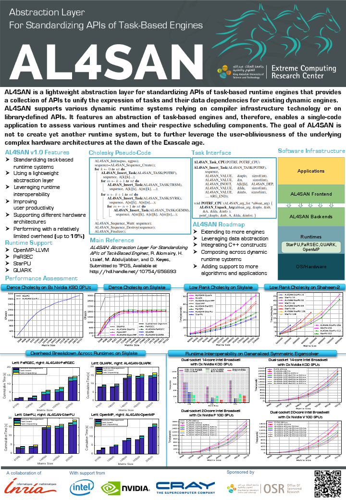

# AL4SAN:  Abstraction Layer For Standardizing APIs of task-based eNgines.
AL4SAN stands for an Abstraction Layer library For Standardizing APIs of task-based eNgines. 
AL4SAN is designed as a lightweight software library, which provides a collection of APIs to unify the expression of tasks and their data dependencies from existing dynamic engines. AL4SAN supports various dynamic runtime systems relying on compiler infrastructure technology and on library-defined APIs. It features an abstraction of task-based engines and, therefore, enables a single-code application to assess various runtimes and their respective scheduling components, while further leveraging the user-obliviousness of the underlying complex hardware configurations. 

This abstraction paradigm improves user productivity by facilitating the design of high performance algorithms on different type of architectures:
shared-memory systems, GPU-based nodes, distributed-memory hardware configurations, etc.



## Get AL4SAN

  To use latest development of AL4SAN, please clone the master
  branch. Note that AL4SAN contains a ~git submodule~ *al4san_cmake*.
  To get sources please use these commands:

```sh
    git clone https://github.com/ecrc/al4san
    cd al4san
    git submodule update --recursive --init
```

## Build AL4SAN

  AL4SAN uses CMake as a build generator, you need to call `cmake` in order to create the Makefiles

### QUARK
   You can get quark from our fork https://github.com/ecrc/quark

```sh
    git clone https://github.com/ecrc/quark
    cd quark
    make
    make install prefix=<quark-installation-prefix>

    # AL4SAN
    cd al4san
    mkdir build
    cd build
    cmake .. -DCMAKE_INSTALL_PREFIX=<install-prefix> -DAL4SAN_SCHED_QUARK=ON -DQUARK_INCDIR=<quark-install-prefix>/include -DQUARK_LIBDIR=<quark-install-prefix>/lib -DAL4SAN_ENABLE_EXAMPLE=ON
    make
    make test
    make install
```

### StarPU
```sh
    # AL4SAN
    cd al4san
    mkdir build
    cd build
    cmake .. -DCMAKE_INSTALL_PREFIX=<install-prefix> -DAL4SAN_SCHED_STARPU=ON -DAL4SAN_ENABLE_CUDA=OFF -DAL4SAN_USE_CUDA=OFF
    make
    make install
```

### PaRSEC
  You can get PaRSEC from https://bitbucket.org/icldistcomp/parsec
```sh
    # AL4SAN
    cd al4san
    mkdir build
    cd build
    cmake .. -DCMAKE_INSTALL_PREFIX=<install-prefix> -DAL4SAN_SCHED_PARSEC=ON -DAL4SAN_USE_MPI=ON
    make
    make install
```

### OpenMP-LLVM
```sh
    # LLVM
    export CC=clang
    export CXX=clang++
    export FC=flang

    # AL4SAN
    cd al4san
    mkdir build
    cd build
    cmake .. -DCMAKE_INSTALL_PREFIX=<install-prefix> -DAL4SAN_SCHED_OPENMP=ON -DAL4SAN_ENABLE_EXAMPLE=ON
    make
    make test
    make install
```
